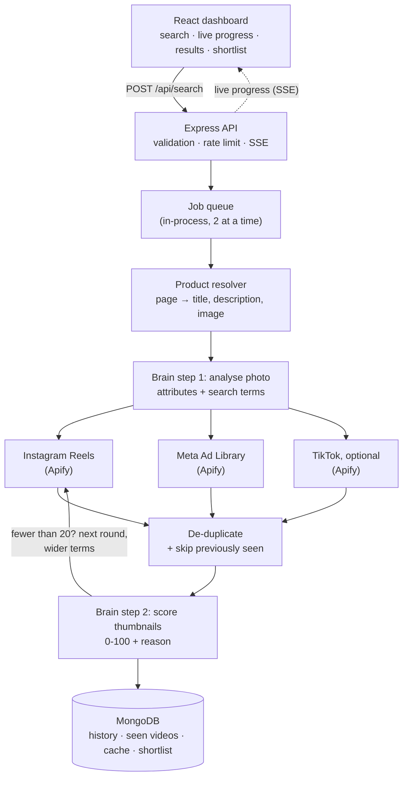
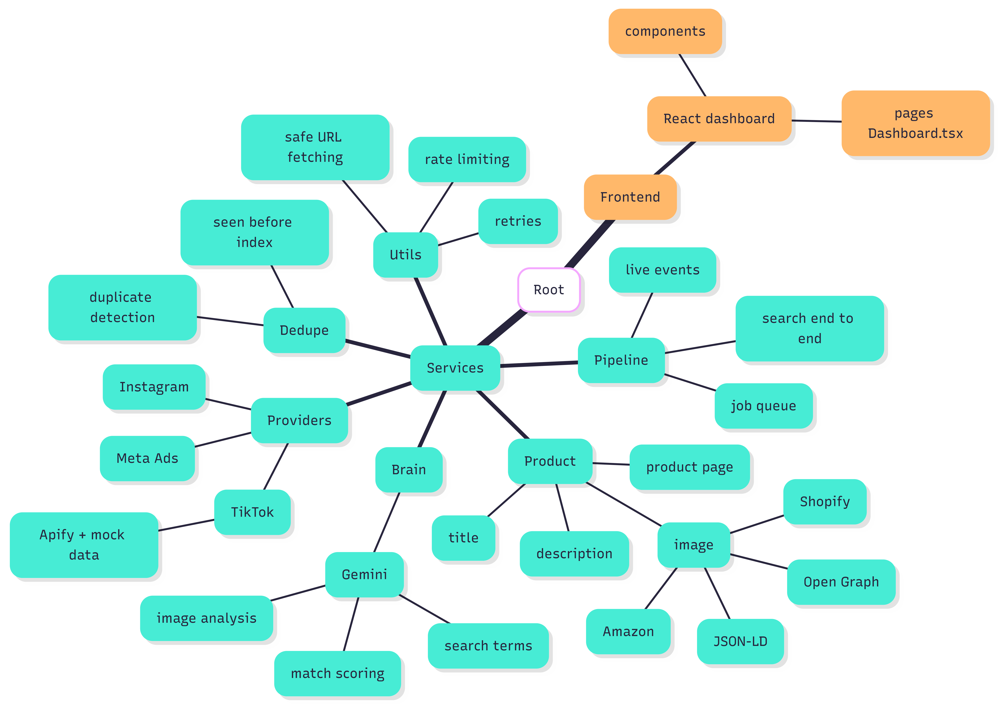

# Product Video Discovery Dashboard

Give it a product **name**, **link** or **photo**. It finds **20 Instagram Reels and 20 Meta Ad Library videos** that show that exact product, and gives each video a **0-100 match score with a reason**.

An image-analysis "brain" (Google Gemini) looks at the product photo first, uses what it sees to search, then checks every video thumbnail against the photo. A tumbler in a different colour or a special edition counts as a *different* product.

**Stack:** Node.js + Express (TypeScript) · React + Vite + Tailwind · MongoDB · Apify (scraping) · Gemini (vision) · Docker

---

## Quick start

You need two keys in `backend/.env` (copy `backend/.env.example` first):

| Key | Used for | Get it at |
|---|---|---|
| `APIFY_TOKEN` | Scraping Instagram, Meta Ad Library, TikTok | [console.apify.com](https://console.apify.com/settings/integrations) |
| `GEMINI_API_KEY` | The image brain | [aistudio.google.com/apikey](https://aistudio.google.com/apikey) |

**Docker (one command):**

```bash
docker compose up --build        # open http://localhost:8080
```

**Or run locally** (Node 20+, MongoDB or Atlas):

```bash
cd backend  && npm install && npm run dev     # http://localhost:4000
cd frontend && npm install && npm run dev     # http://localhost:5173
```

Other commands (in `backend/`): `npm test` (51 unit tests) · `npm run evaluate` (5+ product test run) · `PROVIDER_MODE=mock npm run dev` (fake data, no API cost)

---

## MVP architecture




```
backend/src/
  services/product/      product page → title, description, image (Shopify, JSON-LD, Amazon, Open Graph)
  services/brain/        Gemini: image analysis, search terms, match scoring
  services/providers/    Instagram, Meta Ads, TikTok (Apify) + mock data
  services/dedupe/       duplicate detection + "seen before" index
  services/pipeline/     runs a search end to end, job queue, live events
  utils/                 safe URL fetching, retries, rate limiting
frontend/src/            React dashboard (components/, pages/Dashboard.tsx)
```


---

## How it works

**1. Product.** A link is fetched safely and the title, description and main image are extracted. An uploaded photo takes priority. A name-only search has no photo, so it's matched against a text description (less precise; the UI says so).

**2. Brain: analyse.** Gemini reads the photo and lists the product type, colours, prints, logos, text on the product, material, shape and distinctive details. From these it writes search terms for each platform: hashtags for Instagram, ad phrases for Meta.

**3. Collect.** All sources are scraped **in parallel** through Apify. If one fails, the others carry on.

**4. De-duplicate.** Repeats are removed by video ID, video file, Meta "same ad creative" ID, caption + creator, and a **perceptual hash** of the thumbnail (catches re-uploads). Videos shown in **any earlier search** are skipped, so every search shows new videos. A "Show previously seen" toggle brings them back.

**5. Brain: score.** Each thumbnail is compared with the product photo (8 per Gemini call) using a fixed rubric:

| Score | Meaning |
|---|---|
| 90-100 | Exact product: logo, print, colour, shape all match |
| 70-89 | Very close: same product, small details hidden |
| 40-69 | Same category only: a key detail differs (colour, print, edition) |
| 0-39 | Different product, or not visible |

**Threshold: 65.** Videos scoring 65+ count toward the 20. Lower scores are hidden behind "Show below threshold", not deleted. Engagement only breaks ties, so a viral lookalike can't outrank the real product.

**6. Refill.** If a source has fewer than 20 verified videos, it runs up to 3 rounds with wider terms, related hashtags and deeper pages. If it still falls short, the tab shows `14/20` and explains where the videos went.

**Bonus features:** TikTok (behind its own toggle) · shortlist with CSV/JSON export · one-command Docker.

---

## Real results so far

**Brain test (real data).** Product: the Stanley Quencher 40oz in *lavender*. Every caption below said "Stanley Quencher H2.0", so a keyword-based system would have accepted them all:

| Brain score | Brain's reason | Verdict |
|---|---|---|
| 70 | "matching lavender tumbler shown among group" | ✅ accepted |
| 50-52 | "same model in red / grey / white colorway" | ❌ rejected |
| 32 | "shows Hello Kitty / Ronaldo edition box" | ❌ rejected |
| 28 | "shows lid topper accessory instead of tumbler" | ❌ rejected |

**Full live search** (Docker, real scraping + Gemini): **27/20 Instagram** and **19/20 Meta** verified videos, about $1.10 of Apify credit.

**Uniqueness** (mock data, 3 identical searches in a row): 0 videos repeated between searches, 0 duplicates inside any result set.

**5-product evaluation: not run yet.** It needs about $4-7 of Apify credit and more Gemini calls than the free tier allows in one day. The script is ready (`npm run evaluate` writes `docs/test-results.md`). I chose to save the remaining credit for the demo video.

---

## Cost per search

Apify charges **per video scraped**. These are the prices we were billed on the Free plan:

| Source | Price per item | One round (40 items) |
|---|---|---|
| Instagram Reels | $0.0026 | ~$0.10 |
| Meta Ad Library | $0.0058 | ~$0.23 |
| TikTok (optional) | $0.0037 | ~$0.15 |

A search runs 1-3 rounds per source, depending on how quickly it finds 20 verified videos.

**What real searches cost:**

| Search | Instagram | Meta | TikTok | Total |
|---|---|---|---|---|
| First live search, *before* the cost fixes | 100 items · $0.26 | 213 items · $1.39 (176 were duplicates) | off | **~$1.65** |
| Live search, *after* the fixes | 76 items · $0.20 | 124 items · $0.72 | 42 items · $0.16 | **~$1.10** |
| Expected range (Instagram + Meta, TikTok off) | $0.10-0.30 | $0.23-0.70 | - | **~$0.35-1.00** |

**What we learned:**
- **Meta is the expensive source.** It's about two-thirds of the cost: ads cost twice as much per item, and the same ad often appears under many IDs.
- **Strict matching costs more.** Rejecting other colourways and editions means more rounds to reach 20 verified videos.
- **Apify's free $5/month covers about 5 searches.** Real use needs a paid plan.
- **Gemini:** a search uses about 15-25 calls (1 photo analysis, plus 1 call per 8 thumbnails). The free tier allows ~20 calls per day per model, so with the 4-model fallback that's only a few searches a day. We didn't measure paid Gemini costs because we stayed on the free tier.

**How the app keeps costs down:** a fixed budget per round (`RESULTS_PER_ROUND`), no scraping when the brain is down, stopping when a round brings in fewer than 5 new videos, cached product analysis, and an estimated cost shown for each source in the dashboard.

---

## Problems we hit and how we solved them

| Problem | What we did |
|---|---|
| **Official APIs weren't usable.** Instagram has no keyword search for reels; our Meta app was the wrong type to get a user token; the official Ad Library API only returns product ads shown in the EU/UK. | Switched to **Apify** scrapers, which read the public Instagram and Ad Library pages. Each source sits behind one small interface, so it can be swapped later. |
| **Gemini 2.5 Flash is retired for new keys**, even though it still appears in the model list. | Default to **Gemini 3.8 Flash**, with an automatic **fallback chain** (3.7 → 3.6 → 3.5) when a model is retired, overloaded or out of quota. |
| **The Gemini free tier allows about 20 requests per day per model.** | Batch **8 thumbnails per call**; fall back to other models (each has its own quota). |
| **The first live search cost ~$1.65.** Meta's result limit applies *per keyword*, not per run, and the search kept going after Gemini had failed. | Fixed per-round budgets (`RESULTS_PER_ROUND`); **never scrape when the brain is down**; stop when a round brings in fewer than 5 new videos; show the estimated cost per source. |
| **Captions can't be trusted.** Posts of other colourways and editions all name the product. | The brain judges the **image first**. A caption can't lift a visually different product above 39. |
| **Shopify pages were flagged as "blocked by captcha"** because they load a reCAPTCHA script. | Only real bot walls count: 403/503 responses, Amazon's captcha page, or "captcha" with no product data. |
| **Instagram thumbnail links expire within hours** and can't be shown on other sites. | Thumbnails are downloaded once and served by our backend; videos play through a restricted proxy. |
| **On Windows, Node couldn't resolve Atlas `mongodb+srv://` addresses.** | Use the standard `mongodb://host1,host2,host3` connection string. |
| **Without MongoDB, every query hung for 10 seconds.** | Queries fail fast, and the app falls back to in-memory storage. |

---

## Honest limitations

- **Scraping is a grey area.** Reading public Instagram and Facebook pages through a third party goes against their terms of service. Production use should move to approved access (Meta Content Library or brand-owned accounts).
- **20 + 20 isn't guaranteed.** Strict matching plus niche products can mean fewer real matches. The app shows the shortfall instead of padding results with lookalikes, as in the 19/20 Meta result above.
- **Thumbnails only.** If the product appears only mid-video, the cover image may miss it.
- **Name-only searches are weaker** (no reference photo). A product link or photo works much better.
- **Some product pages block bots** (often Amazon). The app reports it and suggests uploading a photo instead.
- **Free tiers are small.** Apify's $5/month covers only a few searches (~$0.50-1.00 each), and the Gemini free tier only a few searches per day.
- **Accuracy isn't measured at scale yet.** The brain test and one live search look right, but the 5-product evaluation is still pending (see above).
- **Single-server queue.** A restart loses searches in progress; finished searches are saved.
- **Scrapers can change their output.** Fields are read defensively, but a big change could need a fix in one provider file.

---

## Assignment checklist

| Area | Status |
|---|---|
| Video sourcing (25) | ✅ Instagram + Meta via Apify, parallel, refill rounds, shortfalls explained |
| Image brain (25) | ✅ Attributes → search terms → 0-100 scores with reasons, threshold 65 |
| Uniqueness (15) | ✅ 5 duplicate signals, global "seen" index, "Show previously seen" toggle |
| Backend (15) | ✅ Job queue, SSE, retries/timeouts, caching, SSRF protection, rate limiting |
| Dashboard (10) | ✅ Photo upload, live progress, tabs with counts, filters, history, error states |
| Docs + demo (10) | ✅ This README · ⏳ demo video · ⏳ 5-product evaluation |
| **Bonus** | ✅ TikTok toggle · ✅ shortlist + CSV/JSON export · ✅ Docker one-command |

## What I'd build next

1. Check 2-3 frames per video instead of only the thumbnail.
2. A cheap image-embedding prefilter before the Gemini check, to handle more videos for less.
3. A durable job queue (BullMQ + Redis).
4. Find a reference photo automatically for name-only searches.
5. Move to official data access for Instagram and Meta.

## Main settings (`backend/.env`)

| Setting | Default | Meaning |
|---|---|---|
| `PROVIDER_MODE` | `live` | `mock` = fake data, no API cost |
| `GEMINI_MODEL` / `GEMINI_FALLBACK_MODELS` | `gemini-3.8-flash` / 3.7, 3.6, 3.5 | Vision models |
| `MATCH_THRESHOLD` | `65` | Minimum score to count as a match |
| `RESULTS_PER_ROUND` | `40` | Videos scraped per source per round (controls cost) |
| `MAX_SEARCH_ROUNDS` | `3` | Refill rounds per source |
| `ENABLE_TIKTOK` | `true` | Allow the optional TikTok source |

Full list with comments: [`backend/.env.example`](backend/.env.example)
