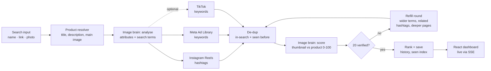

# Product Video Discovery Dashboard

Type a product name, paste a product link, or upload a photo. The dashboard returns **at least 20 Instagram Reels and 20 Meta Ad Library videos that show that exact product**, each with a 0-100 match score and a plain-English reason ("same print and colour, worn by a model").

An image-analysis "brain" (Google Gemini) reads the product photo first. It uses what it sees to build the search terms, then checks every video thumbnail against the photo, so results show *your* product rather than anything in the same category.

**Stack:** Node.js + Express + TypeScript · React + Vite + Tailwind · MongoDB · Apify (scraping) · Gemini (vision)

---

## Contents

1. [Quick start](#1-quick-start)
2. [How it works](#2-how-it-works)
3. [Video sources: how each one is collected](#3-video-sources-how-each-one-is-collected)
4. [The image-analysis brain](#4-the-image-analysis-brain)
5. [Unique results and de-duplication](#5-unique-results-and-de-duplication)
6. [Backend and API](#6-backend-and-api)
7. [Dashboard](#7-dashboard)
8. [Test evidence](#8-test-evidence)
9. [Evaluation criteria: where each one is covered](#9-evaluation-criteria-where-each-one-is-covered)
10. [Known limitations](#10-known-limitations)
11. [What I would build next](#11-what-i-would-build-next)

---

## 1. Quick start

You need two API keys:

| Key | What it's for | Where to get it |
|---|---|---|
| `APIFY_TOKEN` | Scrapes Instagram, Meta Ad Library and TikTok | [console.apify.com](https://console.apify.com/settings/integrations) → Settings → API & Integrations |
| `GEMINI_API_KEY` | The image brain (analysis + match scoring) | [aistudio.google.com/apikey](https://aistudio.google.com/apikey) (free tier available) |

### Option A: Docker (one command)

```bash
cp backend/.env.example backend/.env     # then paste your two keys into backend/.env
docker compose up --build
```

Open **http://localhost:8080**. MongoDB, the backend and the frontend all start together.

### Option B: Run locally

Requires Node.js 20+ and MongoDB (local, Docker, or a free [Atlas](https://www.mongodb.com/atlas) cluster).

```bash
# Backend (http://localhost:4000)
cd backend
cp .env.example .env        # paste APIFY_TOKEN, GEMINI_API_KEY and your MONGODB_URI
npm install
npm run dev

# Frontend (http://localhost:5173), in a second terminal
cd frontend
npm install
npm run dev
```

Open **http://localhost:5173**.

### Useful commands

| Command (in `backend/`) | What it does |
|---|---|
| `npm test` | 51 unit tests: de-duplication, perceptual hashing, scoring rubric, ranking, query planning, SSRF guard, product-page parsing |
| `npm run evaluate` | Runs the 5+ product test set through the live API and writes [`docs/test-results.md`](docs/test-results.md) |
| `PROVIDER_MODE=mock npm run dev` | Offline mode with generated videos (no Apify credit used) for UI work |

> **No keys?** The app still starts. A banner explains what's missing. Without `GEMINI_API_KEY`, scores fall back to caption text and are labelled **"Caption-only score"** in the UI. Without MongoDB, everything works in memory but resets on restart.

---

## 2. How it works



**One search, step by step:**

1. **Resolve the product.** For a link, the server safely fetches the page and extracts the title, description and main image (Shopify JSON, JSON-LD, Amazon markup, Open Graph). An uploaded photo takes priority over the page image.
2. **Analyse the image.** Gemini lists the product type, colours, prints/graphics, logos, text on the product, material, shape and distinctive details, then writes search terms for each platform.
3. **Collect videos.** Instagram, Meta (and TikTok, if switched on) are scraped **in parallel**. If one source fails, the others continue.
4. **Remove duplicates** within the search, and **skip anything already shown** in earlier searches.
5. **Score.** Each thumbnail is compared with the product photo and gets a score from 0 to 100, a verdict and a reason.
6. **Refill if short.** If a source has fewer than 20 verified videos, it runs another round with wider terms, related hashtags and deeper pagination, up to 3 rounds.
7. **Save and stream.** Results stream to the browser live. Everything shown is recorded so the next search returns new videos.

---

## 3. Video sources: how each one is collected

All three sources use **[Apify](https://apify.com)**, a scraping platform that runs headless browsers on rotating residential proxies and returns clean JSON. One token covers every source.

| Source | Apify actor | Search method | Why this method |
|---|---|---|---|
| **Instagram Reels** (required) | `apify/instagram-hashtag-scraper` (reels mode) | Hashtags from the brain, e.g. `#stanleyquencher` | Instagram has **no public keyword search** for reels, and the official Graph API only covers accounts you own or hashtags via an approved business app. Creators tag product videos consistently, so hashtags are the most reliable way in. |
| **Meta Ad Library** (required) | `apify/facebook-ads-scraper` | Ad Library search URL per keyword, `media_type=video`, all countries | The official Ad Library API only returns commercial ads delivered in the **EU/UK** (elsewhere, political ads only) and needs an identity-verified developer account. The public Ad Library website shows every ad, and the scraper reads exactly that. |
| **TikTok** (optional bonus) | `clockworks/tiktok-scraper` | Keyword search | Behind its own toggle in the search bar (and `ENABLE_TIKTOK` on the server). It runs in parallel and **never blocks** the two required sources. |

**Why a scraping provider rather than our own browser automation:** Instagram and Facebook block datacenter IPs and show login walls within a few requests. Maintaining proxies, sessions and selectors would take longer than the whole assignment. Apify handles that layer, and every source sits behind one small `VideoProvider` interface, so any of them can be swapped (for example, for an official API) without touching the pipeline.

### Rate limits, blocked requests, login walls and missing data

| Problem | How it's handled |
|---|---|
| **Rate limits** | Apify rotates proxies on its side. We cap concurrent Apify runs (4) and Gemini requests (`GEMINI_CONCURRENCY`). Gemini `429` responses are retried using the server's suggested wait time. Each user is limited to 6 searches/minute. |
| **Blocked requests / login walls** | Handled by Apify's proxies. If a run still fails, it's retried once with backoff. Errors are translated into actionable messages (bad token, out of credit, actor timed out) and shown on that source's tab. |
| **Timeouts** | Every external call has a timeout (Apify run: 240s; Gemini: 60s; product page: 12s) and a capped number of retries. Nothing waits forever. |
| **Missing data** | Items without a video or thumbnail are skipped and counted. Field names are read defensively (scrapers mix `camelCase` and `snake_case`). A video whose thumbnail can't be downloaded is marked "Can't verify" rather than guessed. |
| **One source down** | Sources run with `Promise.allSettled`. The search finishes as **partial**, the failed tab shows the error and a **Retry** button, and the other tabs show their results. |
| **Product page blocked (e.g. Amazon captcha)** | Detected and reported with a clear next step: upload the product photo or search by name. |

### When a source returns fewer than 20 usable videos

The pipeline never fails silently:

1. **Refill rounds (up to 3 per source).** Each round takes the next, broader slice of the brain's search terms. Instagram also adds **related hashtags** that appear on 2+ already-verified videos (generic tags like `#fyp` are ignored). When the terms run out, it repeats them with **deeper pagination**.
2. **Visible shortfall.** If a source still ends below 20, its tab count turns amber (e.g. `14/20`) and a message explains exactly where the videos went. For example: *"180 videos fetched, 42 duplicates removed, 31 already shown in earlier searches, 90 checked by the image brain, 55 scored below the 65 threshold"*, followed by what to try next.
3. **Nothing hidden.** The **Show below threshold** toggle reveals the near-misses, clearly marked.

---

## 4. The image-analysis brain

**Model: Google Gemini 2.5 Flash** (configurable with `GEMINI_MODEL`).

**Why Gemini:**
- **Accurate on fine detail.** It reliably reads logos and small on-product text, and tells colourways and prints apart, which is exactly what separates "this product" from "the same category".
- **Cheap at scale.** A search compares up to ~90 thumbnails per source. Gemini bills a small image (≤384px) at a flat ~258 tokens, and we send 6 thumbnails per request alongside one reference image, so a full search costs a few cents. A free tier is available.
- **Structured output.** A JSON response schema means the model must return valid scores, verdicts and reasons. Nothing has to be parsed out of free text.
- **Easy to swap.** It sits behind two functions (`analyzeProduct`, `scoreCandidates`), so another vision model could replace it.

I chose a **vision-language model** over **image embeddings** (CLIP-style similarity) because embeddings are good at "same category" but weak at "same exact product". A plain black tee and a black tee with a specific graphic embed close together. A VLM can be told explicitly that the print, logo text and colourway must match, and it can explain its decision.

### Step 1: Analyse the product image

Gemini receives the product photo (plus the page title and description) and returns:

| Attribute | Example (Stanley Quencher) |
|---|---|
| Product type | insulated tumbler |
| Brand | Stanley |
| Colours | rose quartz pink |
| Prints / graphics | none |
| Logos | Stanley bear logo on front |
| Text on product | STANLEY |
| Material | stainless steel, powder coat |
| Shape | tapered cup, side handle, straw lid |
| Distinctive features | FlowState rotating lid, handle shape |
| Summary | "Pink 40oz Stanley Quencher tumbler with handle and straw lid" |

All of these attributes appear in the dashboard's **Product panel**.

### Step 2: Turn attributes into search terms

From the same analysis, Gemini writes terms tailored to each platform, ordered **most specific → broadest**:

- **Instagram:** hashtags creators actually use (`stanleyquencher`, `stanleyquencherh20`, `stanleytumbler`, ...)
- **Meta:** phrases advertisers put in ad copy (`Stanley Quencher H2.0`, `Stanley 40 oz tumbler`, ...)
- **TikTok:** search phrases (`stanley quencher pink review`, ...)

Round 1 uses the most specific terms. Refill rounds move to broader ones. A deterministic fallback pads the list if the model returns too few.

### Step 3: Score every video against the product

For each video, the thumbnail is downloaded, resized to 384px, and sent in a batch of 6 together with the reference photo, the attribute list and the video captions. The model scores each thumbnail with a fixed rubric:

| Score | Verdict | Meaning |
|---|---|---|
| **90-100** | Exact product | Logo, print/graphic, colours, shape and on-product text all match where visible |
| **70-89** | Very close | Almost certainly the same product; small details hidden by angle, lighting or motion |
| **40-69** | Same category only | Similar type/style, but a key detail differs (print, colourway, logo, model) or can't be confirmed |
| **1-39** | Different product | Another product, or the product isn't shown |
| **≤30** | Can't verify | Unreadable thumbnail, text card, face only |

Rules built into the prompt:
- **The image decides.** A caption naming the product can raise confidence only when the picture agrees. It can never lift a visually different product above 39.
- **A different colourway or print is not exact.** It scores 40-69.
- **People wearing or holding the product is fine.** The product itself is judged.
- Every score comes with a **reason** (shown on the card) plus **matched** and **mismatched** attributes (✓ logo, colour · ✗ print).
- The verdict is always derived from the number, so a score and its label can never disagree.

### Match threshold: 65

Videos scoring **65 or above** count as verified and toward the 20-video minimum. Videos below 65 are **not deleted**: they're hidden behind **Show below threshold** and clearly badged.

Why 65: it sits at the top of the "same category only" band. It accepts every "very close" or "exact" match, plus the upper part of the band where the model saw the right product but couldn't confirm one detail (for example, the logo facing away from the camera). It rejects lookalikes with a visibly different detail, which the rubric places at 40-60. The threshold is a setting (`MATCH_THRESHOLD`) if a stricter or looser cut is needed.

### Ranking

Verified videos are sorted by **match score**. Engagement (views/likes) and recency only break ties, so a viral video of a lookalike can never outrank a quiet video of the exact product.

### No reference photo?

For a **name-only** search there's no product photo, so the brain works from the text and the panel says so: *"No reference photo, so videos are matched against the description only."* Scoring is stricter in this mode (capped at 85 unless the brand and on-product text are clearly readable). The UI encourages uploading a photo, which is the optional third input.

### Cost control

- The cheap caption-relevance score decides **which** candidates get vision-checked first. It never discards anything on its own.
- Each source is capped at `MAX_VISION_PER_SOURCE` (90) vision checks per search.
- Product-page parsing and image analysis are **cached** per link/photo for 7 days, so repeat searches skip both.

---

## 5. Unique results and de-duplication

### Within one search: no duplicates or near-duplicates

Checked from cheapest to most robust. The first copy (the best match) wins:

| # | Signal | Catches |
|---|---|---|
| 1 | Platform + video ID | The same video returned by two hashtags or two rounds |
| 2 | Media file name (from the video URL, ignoring signed query strings) | One video file referenced by several posts or ads |
| 3 | Meta "collation ID" | **The same ad creative running under several ad IDs** |
| 4 | Normalised caption + same creator (hashtags, emoji, links, punctuation removed) | Reposts of the same post |
| 5 | **Perceptual hash (dHash)** of the thumbnail, ≤ 5 of 64 bits different | **Re-uploads and re-encodes**, including by other accounts |

**How the perceptual hash works:** the thumbnail is shrunk to 9×8 greyscale pixels, and each bit records whether a pixel is brighter than its right-hand neighbour. Re-encoding, resizing and light crops change only a few bits, while different images differ by 20+. Near-blank thumbnails (all black, all white) are excluded, because they'd all look alike.

### Across searches: every search shows new videos

- Every video **shown** (verified or below threshold) is stored in a `SeenVideo` collection: its ID, media key, perceptual hash, and the search that returned it.
- Before scoring, each new candidate is checked against this index by ID, media file and perceptual hash. Matches are filtered out even when **queries overlap between different products**, because the index is global, not per product.
- If filtering leaves a source under 20, the **refill rounds** fetch more (see section 3).
- **Show previously seen** brings those videos back deliberately, each badged *"Seen 08/10/2026"*. Clicking the badge opens the earlier search.

The index loads into memory at startup for fast lookups and is persisted in MongoDB so it survives restarts.

---

## 6. Backend and API

### Structure

```
backend/src/
  config/env.ts                 all settings, read from environment variables
  routes/ + controllers/        thin HTTP layer (validation with zod)
  services/
    product/productResolver     page fetch + extraction + cache
    brain/
      gemini.ts                 Gemini client: JSON schema, concurrency cap, 429 backoff
      productAnalysis.ts        step 1+2: attributes and search terms
      matchScorer.ts            step 3: batched 0-100 scoring + rubric
    providers/                  VideoProvider interface + Instagram, MetaAds, TikTok, mock
    dedupe/                     in-search de-dup + global seen index
    media/imageStore.ts         thumbnail cache, perceptual hash, upload validation
    pipeline/
      jobs.ts                   job registry, background queue, SSE events
      searchPipeline.ts         the orchestration shown in section 2
  utils/                        safeFetch (SSRF guard), retry, concurrency limiter, logger
  models/                       SearchJob, SeenVideo, ProductCache, ShortlistItem
```

### Endpoints

| Method | Path | Purpose |
|---|---|---|
| `POST` | `/api/search` | `{ input, imageDataUrl?, includeTikTok }` → `202 { jobId }`. Validated and rate-limited. |
| `GET` | `/api/search/:id` | Full state: progress, product, per-source results. Works for live and past searches. |
| `GET` | `/api/search/:id/events` | **Server-Sent Events** stream of live progress and partial results |
| `GET` | `/api/history` | Last 50 searches with per-source counts |
| `GET/POST/DELETE` | `/api/shortlist[/:key]` | Saved videos |
| `GET` | `/api/shortlist/export?format=csv\|json` | Download the shortlist |
| `GET` | `/api/media/thumb/:id`, `/api/media/ref/:id` | Cached thumbnails and reference images |
| `GET` | `/api/media/video?url=` | Inline playback proxy (Instagram/Meta CDNs only) |
| `GET` | `/api/health` | Mode, database, scraper and vision status |

### Design choices

- **Background jobs.** `POST /api/search` returns immediately. Searches run in an in-process queue (2 at a time by default), so a slow scrape never blocks a request and bursts can't exhaust quotas.
- **Parallel collection.** All sources run concurrently, each with its own timeouts, retries and error state.
- **Live progress over SSE.** Simpler than WebSockets for one-way updates, and it works through nginx. The client falls back to polling if the stream drops.
- **Caching.** Product page + image analysis (per link/photo, 7 days); thumbnails stored locally (platform CDN links expire within hours, and Instagram's CDN blocks embedding on other sites).
- **Works without MongoDB.** Commands fail fast instead of hanging, and everything falls back to in-memory storage.

### Security

- **SSRF protection** on every server-side fetch of a user-supplied URL: http/https only, standard ports, no embedded credentials, and **every DNS answer** must be a public address (blocks `localhost`, `10.x`, `172.16-31.x`, `192.168.x`, `169.254.169.254` cloud metadata, IPv6 private ranges, IPv4-mapped IPv6). **Redirects are re-validated hop by hop.** Response size is capped.
- **Uploads:** type and size checked, then decoded with `sharp` to prove it's a real image.
- **Video proxy:** allowlisted CDN hosts only, so it can't be used as an open proxy.
- **Media IDs:** must be 40-character hex before touching the filesystem (no path traversal).
- **CSV export:** guards against spreadsheet formula injection.
- **Secrets:** environment variables only; `.env` files are git-ignored; nothing secret is sent to the browser.
- Rate limiting, structured JSON logs, and errors that never leak stack traces.

---

## 7. Dashboard

- **Search bar:** product name or link, an optional **photo upload** (button or drag-and-drop, resized in the browser), and a TikTok toggle.
- **Product panel:** extracted title, main image, analysis mode, **every detected attribute**, and the generated search terms.
- **Live pipeline:** fetching page → analysing image → searching Instagram → searching Meta → (TikTok) → scoring, with details for each step.
- **Results:** a tab per platform with a **live count against the 20 minimum** (green when met, amber when short), plus an "All platforms" tab.
- **Video cards:** thumbnail, **inline playback** (Instagram/Meta), platform badge, score, verdict, reason, ✓/✗ attributes, caption, creator, date, link to the original, and a ☆ shortlist button.
- **Filters and sorting:** match score or newest first, minimum score slider, platform tabs, **Show below threshold**, **Show previously seen**.
- **Search history:** reopens earlier results (stored, not re-run), or **Search again** for new videos.
- **Shortlist:** star videos and export them as CSV or JSON.
- **Error and empty states:** setup warnings, per-source failures with Retry, shortfall explanations, and blocked-page advice.
- **Responsive:** two columns on desktop. On tablet, the product panel and progress come first, then results, then history.

---

## 8. Test evidence

`npm run evaluate` runs the test set below through the live API (Apify + Gemini), then repeats one search to check uniqueness. It writes **[`docs/test-results.md`](docs/test-results.md)** with counts per source, timings, detected attributes, and examples of good matches and rejected videos.

| # | Product | Input type | Why it's in the set |
|---|---|---|---|
| 1 | Stanley Quencher H2.0 tumbler | Name | Branded product, many lookalikes |
| 2 | Allbirds Tree Runners | Shopify link | Link input, Shopify extraction |
| 3 | Oversized graphic tee | Name | Generic query from the brief: no exact product exists |
| 4 | Protein dark chocolate | Name | Generic query from the brief, packaging-heavy |
| 5 | CeraVe Moisturizing Cream | Amazon link | Link input; Amazon may block it (tests the fallback message) |
| 6 | Owala FreeSip bottle | Name | Branded product with distinctive colourways |

> **Status:** the evaluation run needs the API keys and is pending. Results will appear in [`docs/test-results.md`](docs/test-results.md).

---

## 9. Evaluation criteria: where each one is covered

| Area (weight) | What was asked | Where it's handled |
|---|---|---|
| **Video sourcing (25)** | 20 Reels + 20 Meta videos per search, reliably | Apify providers ([section 3](#3-video-sources-how-each-one-is-collected)); refill rounds with wider terms, related hashtags and deeper pages; shortfalls explained in the UI rather than failing silently; per-source error isolation |
| **Image-analysis brain (25)** | Exact product; explained, sensible scores | Gemini attribute extraction → per-platform search terms → batched thumbnail scoring with a fixed rubric; documented threshold (65); a reason plus ✓/✗ attributes on every card ([section 4](#4-the-image-analysis-brain)) |
| **Uniqueness and de-dup (15)** | New videos per search; no duplicates in a set | 5-signal in-search de-dup including perceptual hashing and Meta collation IDs; global seen index across all searches; "Show previously seen" toggle ([section 5](#5-unique-results-and-de-duplication)) |
| **Backend design (15)** | Structure, parallel collection, errors, caching, security | Layered services, background queue, SSE, `Promise.allSettled` per source, retries and timeouts, product/analysis/thumbnail caching, DNS-checked SSRF guard ([section 6](#6-backend-and-api)) |
| **Dashboard (10)** | Usable flow, live progress, filters, clear states | All items in [section 7](#7-dashboard) |
| **Docs and demo (10)** | README, honest limitations, demo video | This README, [Known limitations](#10-known-limitations), [`docs/test-results.md`](docs/test-results.md) |

### Bonus points

| Bonus | Status | Details |
|---|---|---|
| **TikTok as a third source** | ✅ Built | Own toggle in the search bar, plus `ENABLE_TIKTOK` on the server; runs in parallel; never blocks the required sources; same de-dup and scoring |
| **Save or export a shortlist** | ✅ Built | ☆ on any video card; shortlist drawer; **CSV** and **JSON** export; stored in MongoDB |
| **Docker, one command** | ✅ Built | `docker compose up --build` starts MongoDB, the backend and an nginx-served frontend at http://localhost:8080 |

---

## 10. Known limitations

Being upfront about what this does *not* do:

- **Scraping and platform terms.** Instagram and Meta don't offer a public keyword search for this use case, so the app reads public pages through a third-party scraper. That's a grey area under their terms of service. For production I'd move to approved access (the Meta Content Library, or brand-owned accounts through the Graph API).
- **Coverage depends on what's public and tagged.** A niche product with few videos or tags may genuinely have fewer than 20 matching videos on a platform. The app then shows the shortfall and its causes instead of padding results with lookalikes.
- **Thumbnails, not full videos.** Matching uses each video's cover image. If the product appears only later in the video, the cover may score low. (Next step: sample 2-3 frames per video, below.)
- **Name-only searches have no reference photo.** Matching against a text description is less precise. The UI says so and encourages a photo upload.
- **Some product pages block bots.** Amazon often shows a captcha to servers. This is detected and reported, with the suggestion to upload the product photo instead.
- **Scraper output can change.** Apify actors occasionally rename fields. Field reading is defensive and actor IDs are configurable, but a large change could need an update in one provider file.
- **Costs and quotas.** Apify charges per result (the free plan's monthly credit covers a modest number of searches), and the Gemini free tier has per-minute limits that can slow a large search. Both are configurable.
- **Single-instance job queue.** The queue runs inside the backend process, so a restart loses in-flight searches (finished ones are saved). See next steps.
- **Docker setup not tested on the development machine** (Docker wasn't installed there). Both production builds (`npm run build`) were verified directly.

---

## 11. What I would build next

1. **Frame sampling:** extract 2-3 frames per video with ffmpeg and score the best one, so products that appear mid-video are caught.
2. **Hybrid matching:** an image-embedding prefilter (e.g. CLIP) to rank hundreds of candidates cheaply before the VLM check, with the VLM still making the final call.
3. **Durable queue:** BullMQ + Redis so searches survive restarts and can scale across workers.
4. **Reference image for name searches:** fetch the top product image from a shopping search automatically.
5. **Official data access:** apply for the Meta Content Library / Ad Library API for compliant, stable sourcing.
6. **Accuracy loop:** let users mark results right or wrong, and use that labelled data to tune the threshold and prompt.
7. **Multi-user:** accounts, so the seen index and shortlist are per user rather than per installation.

---

### Configuration reference

All settings live in `backend/.env`. See [`backend/.env.example`](backend/.env.example) for the full list with comments. The main ones:

| Variable | Default | Meaning |
|---|---|---|
| `PROVIDER_MODE` | `live` | `live` = Apify scraping, `mock` = generated data |
| `APIFY_TOKEN` | – | Required for live mode |
| `GEMINI_API_KEY` | – | Required for visual matching |
| `GEMINI_MODEL` | `gemini-2.5-flash` | Vision model |
| `MATCH_THRESHOLD` | `65` | Minimum score to count as verified |
| `PER_SOURCE_MINIMUM` | `20` | Target per required source |
| `MAX_SEARCH_ROUNDS` | `3` | Refill rounds per source |
| `MAX_VISION_PER_SOURCE` | `90` | Vision checks per source per search (cost cap) |
| `ENABLE_TIKTOK` | `true` | Allow the optional TikTok source |
| `MONGODB_URI` | local | MongoDB connection string |
